# Reynolds & Heeger 2009 — The Normalization Model of Attention

> ⚠️ **NOT a faithful reproduction (corrected 2026-06-03).** This model previously
> shipped as "FAITHFUL across all 7 figures." That verdict was **wrong**: the schematic
> (Fig 1) is faithful, but **Figures 2–7 carry real divergences** in the model's curve
> shapes and attention-gain magnitudes — the quantitative error that matters precisely
> because this is a *normalization model* (the gain/modulation magnitude *is* the
> scientific claim). The divergences are now **measured against the paper**, not caught
> by eye: each curve is **digitized from the paper panel** (~a dozen points), a Phase-A
> view renders that digitized reference and the implementation through identical pinned
> axes, and three tiers of tests compare them. **Four figures gate red** — 4E (% modulation
> ~390% vs the paper's 0–100 axis), 5 (spatial gain too strong), 6 (feature sharpening
> absent), 7 (combined gain ~3.3× vs ~1.4×). **Figures 2 and 3** pass the gating tests but
> their curve-shape divergence is surfaced by the **soft dozen-point shape check**
> (reported, not blocking — a human promotes it to a hard gate per panel). This entry is a
> documented case of the auditor being too lenient — see "How it was verified."

## Model

Reynolds JH, Heeger DJ. **The Normalization Model of Attention.** *Neuron.* 2009 Jan 29;61(2):168–185. doi:[10.1016/j.neuron.2009.01.002](https://doi.org/10.1016/j.neuron.2009.01.002) (PMCID PMC2752446).

This is the foundational **normalization model of attention**: it explains a large and apparently contradictory body of attention data (contrast-gain vs. response-gain modulation, multiplicative tuning-curve scaling, feature-based sharpening, tuning shifts with two stimuli in the receptive field) with a single divisive-normalization circuit. A population of neurons indexed by receptive-field center `x` and feature preference `θ` receives an excitatory **stimulus drive** `E(x,θ)`, is gated by a multiplicative **attention field** `A(x,θ) ≥ 1`, and is divisively normalized by a pooled **suppressive drive** `S(x,θ)`. The central claim is that the *shape* of attentional modulation is not a free parameter — it emerges from the relative size of the attention field and the stimulus.

The model computes, per neuron, the rectified divisive-normalization response (Eq. 5):

```
R(x,θ) = ⌊ A(x,θ)·E(x,θ) / (S(x,θ) + σ) ⌋_T
```

where the suppressive drive is the suppressive field convolved with the *attention-modulated* stimulus drive (Eq. 6),

```
S(x,θ) = s(x,θ) ∗ [ A(x,θ)·E(x,θ) ],     ∫ s(x,θ) dx dθ = 1   (Eq. 2)
```

`A`, `E`, and the suppressive/stimulation fields all have Gaussian profiles in space and in feature. The attention field is `A = 1 + (γ−1)·G`, a Gaussian bump `G` of peak gain `γ`. Because the same product `A·E` appears in both the numerator and (after pooling) the denominator, growing the attention field relative to the stimulus continuously moves the modulation from a **contrast-gain** signature (a leftward shift of the contrast-response function) to a **response-gain** signature (a multiplicative scaling sustained at high contrast). **The equations themselves map operator-for-operator to the paper and are faithful** — the divergences below are in the model's *quantitative output* (the realized gains and curve shapes), not the transcription of Eqs. 5/6/2.

## How to read the figures below

Each figure is shown **three ways, side by side**:

1. **Paper** — the original panel image (`article_aware/figures/figure_<N>.jpg`).
2. **Reproduced from digitization** — the ~dozen points digitized off the paper panel,
   rendered through the Phase-A-owned view (`figures_reproduced/figure_<N>_reference.png`).
   This is the *reference the tests compare against*; it passed a VLM self-check vs the
   paper panel, so it stands in for the paper's curves quantitatively.
3. **Reproduced from implementation** — the live model output through the *same* view
   (`figures_reproduced/figure_<N>.png`). Phase B cannot change the axes or style; only the
   data differ.

Each figure carries **two VLM checks** (agent-as-VLM, visual judgement), each reported at
**panel** and **figure** level:

- **Digitization self-check** — does the *digitized reference* faithfully capture the paper?
  This validates the reference the quantitative tests compare against. All panels pass.
- **Final-figure check** — does the *implementation* render match the paper? This is the
  holistic faithfulness read; it is **reported, not a gate** (an over-lenient VLM here is
  exactly what passed the original wrong figures — the quantitative tiers below are the gate).

Then a **checks** table: **qualitative** + **hard** tiers *gate* the build (a fail is a real
fail); **soft** tiers are *measured and reported but never block* (a human promotes a soft
check to hard per panel once the digitization is trusted). Omitted panels (empirical data,
schematic configs, legends) appear as explicit **"not reproduced"** placeholders.

## Reproduced figures — paper · digitization · implementation

### Figure 1 — Pipeline schematic  ✅ faithful (schematic)
<table><tr><th>Paper</th><th>Reproduced</th></tr><tr><td>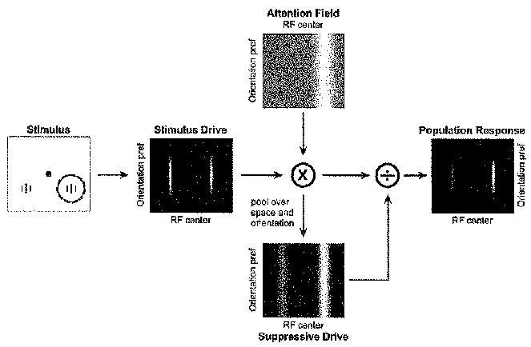</td><td>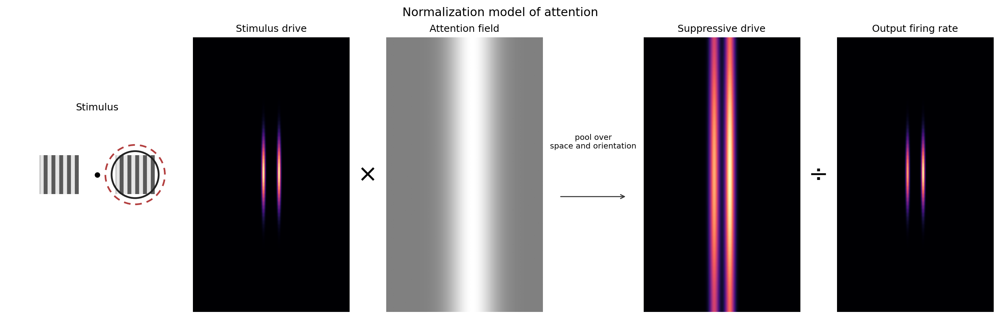</td></tr></table>

The `E × A ÷ S → R` pipeline — stimulus drive, a localized attention field over the attended stimulus, the pooled suppressive drive, and an output that enhances the attended stimulus. The iconography and topology match the paper's architectural figure. (Schematic: no data curve to digitize, so no digitized reference.)

### Figure 2 — Contrast gain vs. response gain  ❌ DIVERGENT — curve shape (soft-reported)

<table>
<tr><th>Paper</th><th>Reproduced from digitization</th><th>Reproduced from implementation</th></tr>
<tr><td>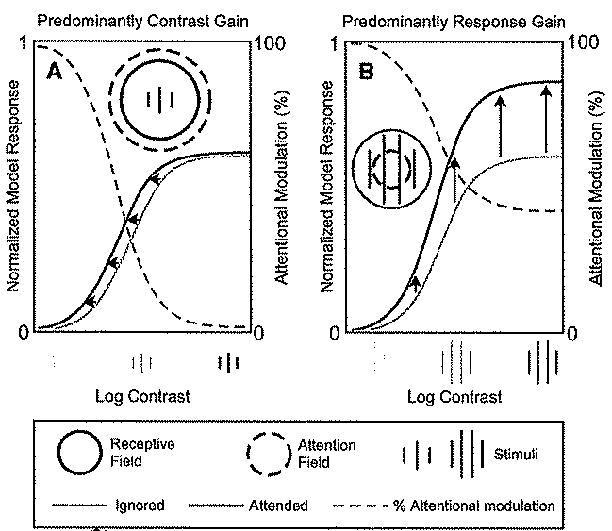</td><td>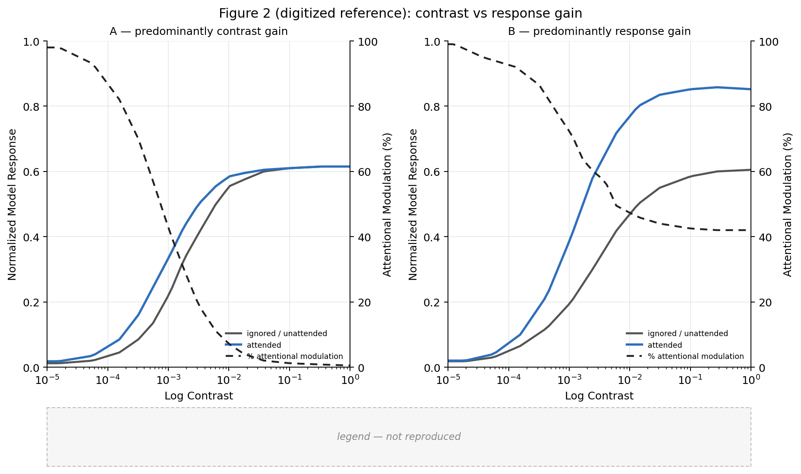</td><td>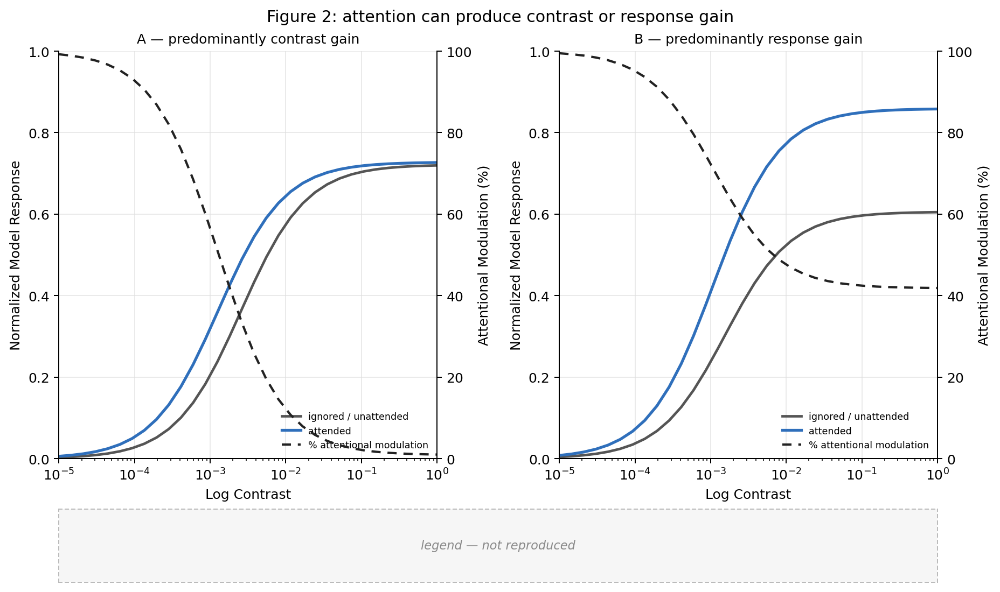</td></tr>
</table>

Digitized reference (middle) reproduces the paper: 2A converges at high contrast with %-modulation falling (contrast gain); 2B stays separated with %-modulation sustained (response gain). The implementation (right) does **not** fully converge in 2A and its %-modulation bottoms ~30% (not ~0) — the shape divergence the soft dozen-point check quantifies.

|  | Digitization self-check (ref vs paper) | Final figure (impl vs paper) |
|---|---|---|
| panel 2A | ✅ faithful | ❌ divergent — doesn't fully converge; %-mod floors ~30% |
| panel 2B | ✅ faithful | ⚠️ partial — response-gain direction right; gain slightly strong |
| **figure** | ✅ **faithful** | ❌ **divergent** |

| Tier | Check | Result |
|------|-------|--------|
| qualitative | 2A attended at or above unattended | ✅ pass |
| qualitative | 2A curves converge at high contrast | ✅ pass |
| qualitative | 2A modulation falls toward high contrast | ✅ pass |
| qualitative | 2B attended above unattended | ✅ pass |
| qualitative | 2B curves do not converge at high contrast | ✅ pass |
| hard | 2A high contrast separation vs digitized | ✅ pass |
| hard | 2B high contrast separation vs digitized | ✅ pass |
| soft | 2A attended value at mid contrast | ✅ pass |
| soft | 2A modulation at low contrast | ⚠️ soft-fail (reported) |
| soft | 2A shape vs digitized | ⚠️ soft-fail (reported) — max Δ 0.22 (curves), 22 (%-mod) |
| soft | 2B shape vs digitized | ⚠️ soft-fail (reported) — max Δ 0.11 (curves), 17 (%-mod) |
| soft | 2B unattended peak vs digitized | ✅ pass |

### Figure 3 — Baseline shift across contrast  ❌ DIVERGENT — shape + % modulation (soft-reported)

<table>
<tr><th>Paper</th><th>Reproduced from digitization</th><th>Reproduced from implementation</th></tr>
<tr><td>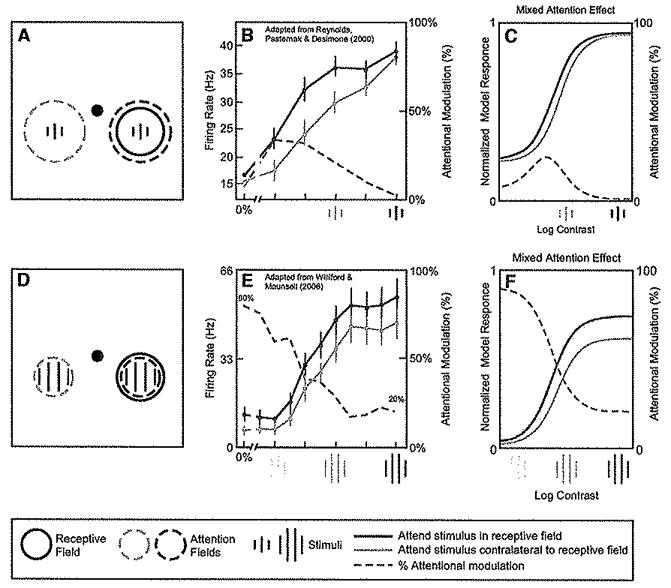</td><td>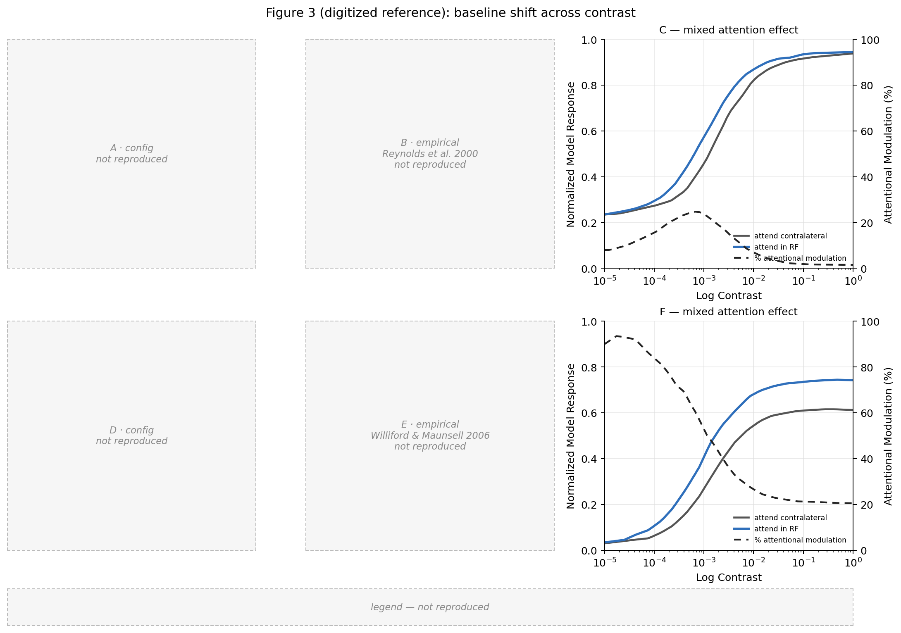</td><td>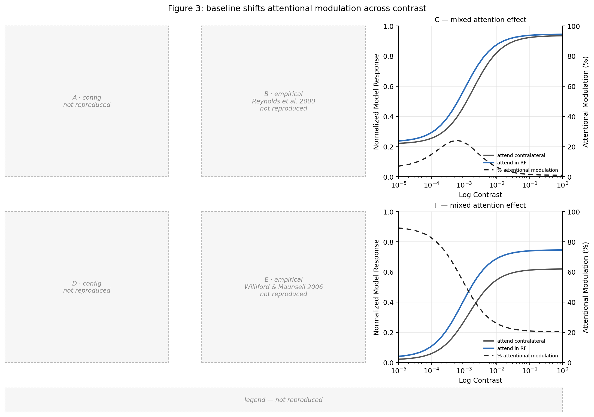</td></tr>
</table>

Digitized reference matches the paper's converging CRFs with an interior %-modulation bump. The implementation diverges in curve shape across the low/mid range and in the %-modulation curve (3F %-mod off by ~57). Empirical panels (B/E) are correctly "not reproduced."

|  | Digitization self-check (ref vs paper) | Final figure (impl vs paper) |
|---|---|---|
| panel 3C | ✅ faithful | ❌ divergent — CRFs too separated; %-mod lacks interior bump |
| panel 3F | ✅ faithful | ❌ divergent — separation larger than the paper's |
| **figure** | ✅ **faithful** | ❌ **divergent** |

| Tier | Check | Result |
|------|-------|--------|
| qualitative | 3C attended at or above unattended | ✅ pass |
| qualitative | 3C curves converge at high contrast | ✅ pass |
| qualitative | 3F attended above unattended | ✅ pass |
| qualitative | 3F separation persists at high contrast | ✅ pass |
| hard | 3C high contrast separation vs digitized | ✅ pass |
| hard | 3F high contrast separation vs digitized | ✅ pass |
| soft | 3C modulation has interior bump | ✅ pass |
| soft | 3C shape vs digitized | ⚠️ soft-fail (reported) — max Δ 0.28 (curves), 27 (%-mod) |
| soft | 3F modulation largest at low contrast | ⚠️ soft-fail (reported) |
| soft | 3F shape vs digitized | ⚠️ soft-fail (reported) — max Δ 0.24 (curves), 57 (%-mod) |

### Figure 4 — Two-stimulus contrast-response modulation  ❌ DIVERGENT — 4E % modulation gates red

<table>
<tr><th>Paper</th><th>Reproduced from digitization</th><th>Reproduced from implementation</th></tr>
<tr><td>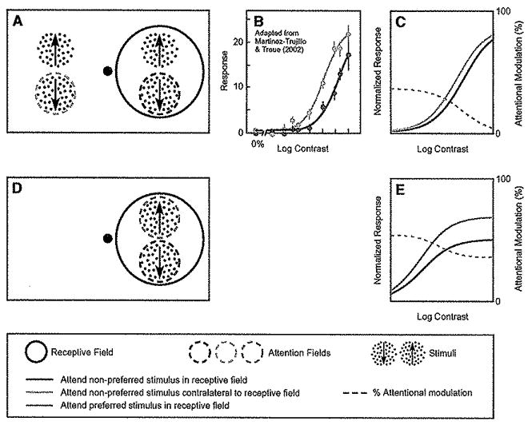</td><td>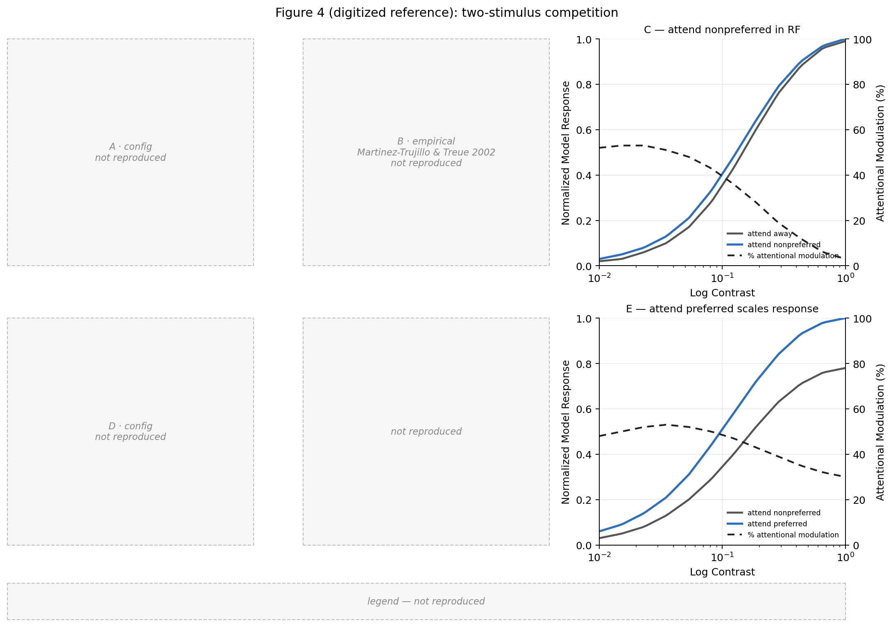</td><td>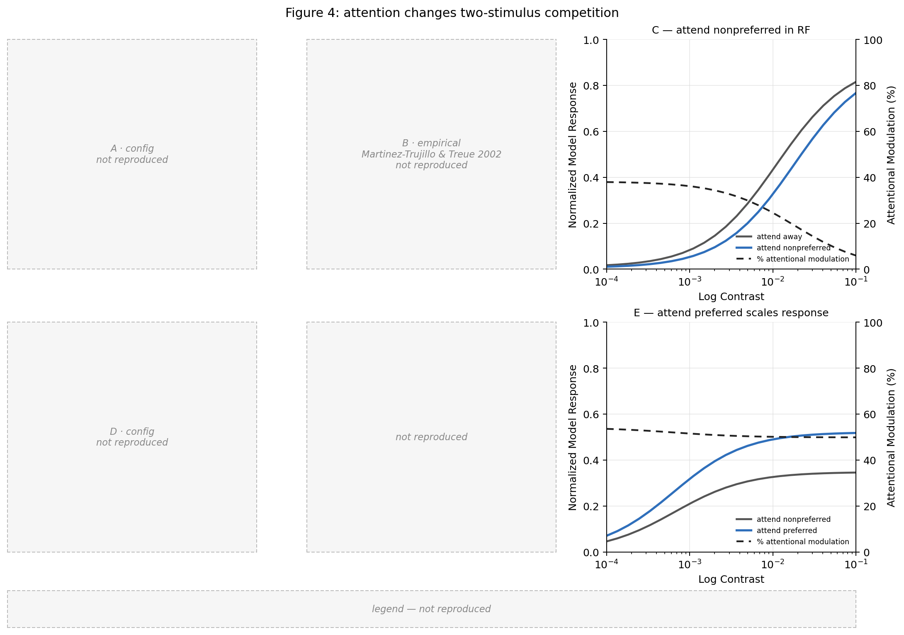</td></tr>
</table>

4C nearly overlaps (faithful). 4E is the headline divergence: %-attentional-modulation reaches ~390% against the paper's 0–100 axis — a **hard gate failure** (also caught by the pinned-axis test that the old auto-scaled view hid).

|  | Digitization self-check (ref vs paper) | Final figure (impl vs paper) |
|---|---|---|
| panel 4C | ✅ faithful | ⚠️ partial — near-overlap roughly held |
| panel 4E | ✅ faithful | ❌ divergent — nonpreferred crushed; %-mod ~390% off-axis |
| **figure** | ✅ **faithful** | ❌ **divergent** |

| Tier | Check | Result |
|------|-------|--------|
| qualitative | 4C curves nearly overlap | ✅ pass |
| qualitative | 4E attend pref above attend nonpref | ✅ pass |
| hard | 4C high contrast separation vs digitized | ✅ pass |
| hard | 4E modulation stays within paper axis | ❌ **FAIL (gates)** |
| soft | 4C modulation declines to high contrast | ✅ pass |
| soft | 4C shape vs digitized | ⚠️ soft-fail (reported) — max Δ 0.16 (curves), 20 (%-mod) |
| soft | 4E high contrast separation vs digitized | ⚠️ soft-fail (reported) |
| soft | 4E shape vs digitized | ⚠️ soft-fail (reported) — max Δ 0.54 (curves), 342 (%-mod) |

### Figure 5 — Spatial attention as multiplicative scaling  ❌ DIVERGENT — gain too strong (gates red)

<table>
<tr><th>Paper</th><th>Reproduced from digitization</th><th>Reproduced from implementation</th></tr>
<tr><td>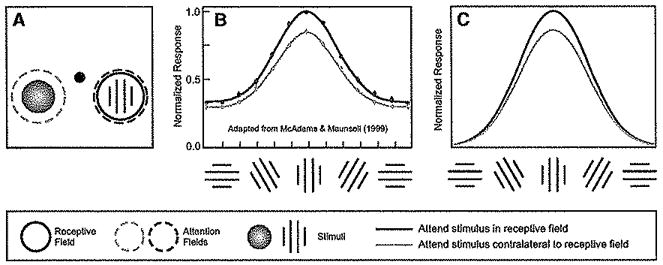</td><td>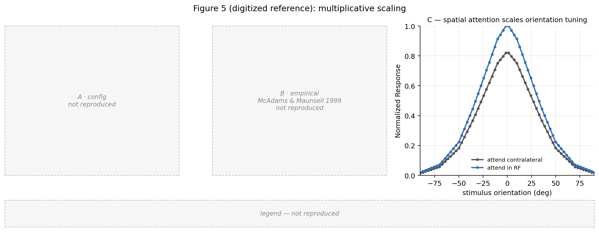</td><td>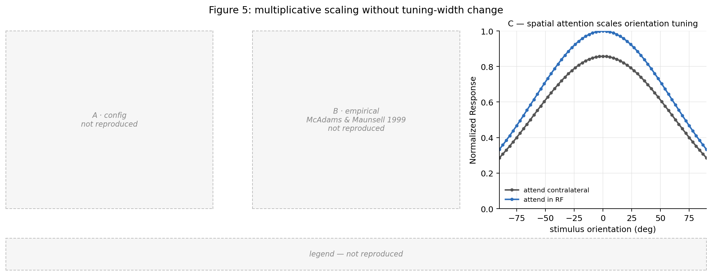</td></tr>
</table>

Multiplicative, same-width scaling (the right *kind* of effect), but the attended/unattended **peak ratio is ~1.59 vs the paper's ~1.22** — gain too strong. Hard ratio test gates red.

|  | Digitization self-check (ref vs paper) | Final figure (impl vs paper) |
|---|---|---|
| panel 5C | ✅ faithful | ❌ divergent — curves too distant (ratio ~1.59 vs ~1.22) |
| **figure** | ✅ **faithful** | ❌ **divergent** |

| Tier | Check | Result |
|------|-------|--------|
| qualitative | 5C attended above unattended over centre | ✅ pass |
| qualitative | 5C same tuning width no sharpening | ✅ pass |
| hard | 5C peak ratio vs digitized | ❌ **FAIL (gates)** |
| soft | 5C shape vs digitized | ⚠️ soft-fail (reported) — max Δ 0.19 (curves) |
| soft | 5C unattended peak vs digitized | ⚠️ soft-fail (reported) |

### Figure 6 — Feature-based attention sharpening  ❌ DIVERGENT — sharpening absent (gates red)

<table>
<tr><th>Paper</th><th>Reproduced from digitization</th><th>Reproduced from implementation</th></tr>
<tr><td>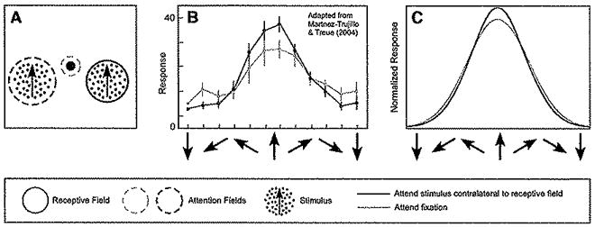</td><td>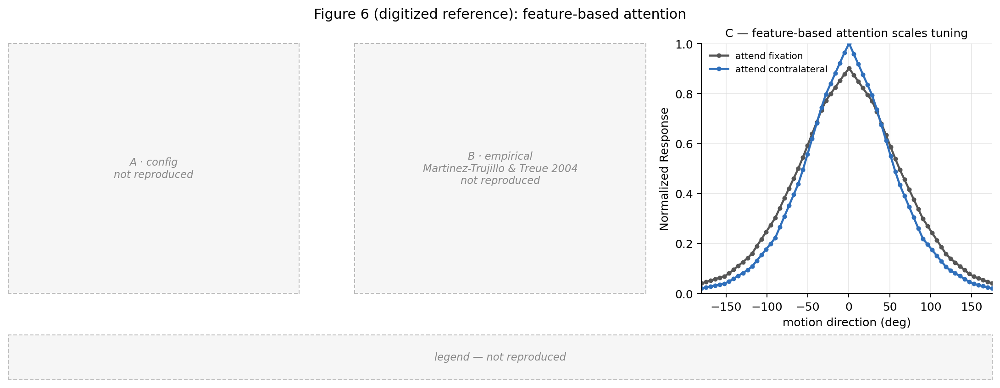</td><td>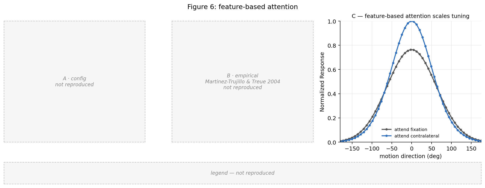</td></tr>
</table>

The paper sharpens the attended curve (peak ~0.10 above fixation, narrower). The implementation's two curves **overlap** (peak gap ~0.009) — the feature-based effect is essentially absent (the opposite failure to Fig 5: too weak rather than too strong). Qualitative + hard tests gate red.

|  | Digitization self-check (ref vs paper) | Final figure (impl vs paper) |
|---|---|---|
| panel 6C | ✅ faithful | ❌ divergent — curves overlap; sharpening absent |
| **figure** | ✅ **faithful** | ❌ **divergent** |

| Tier | Check | Result |
|------|-------|--------|
| qualitative | 6C attended at least as tall at peak | ✅ pass |
| qualitative | 6C sharpening present at peak | ❌ **FAIL (gates)** |
| hard | 6C peak ratio vs digitized | ❌ **FAIL (gates)** |
| soft | 6C flank difference vs digitized | ✅ pass |
| soft | 6C shape vs digitized | ⚠️ soft-fail (reported) — max Δ 0.12 (curves) |

### Figure 7 — Two stimuli in RF: combined attention shifts  ❌ DIVERGENT — gain magnitude (gates red)

<table>
<tr><th>Paper</th><th>Reproduced from digitization</th><th>Reproduced from implementation</th></tr>
<tr><td>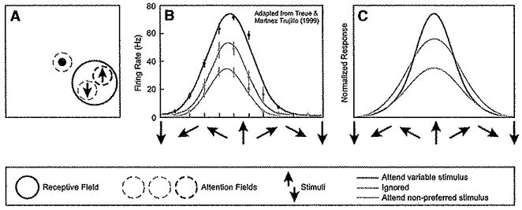</td><td>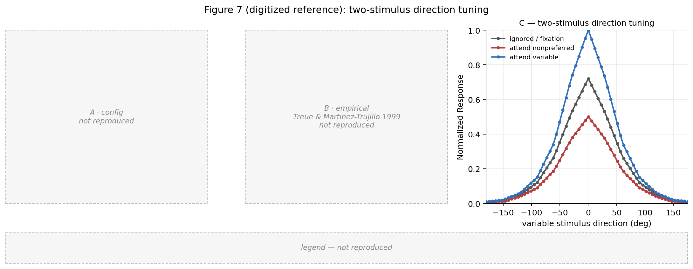</td><td>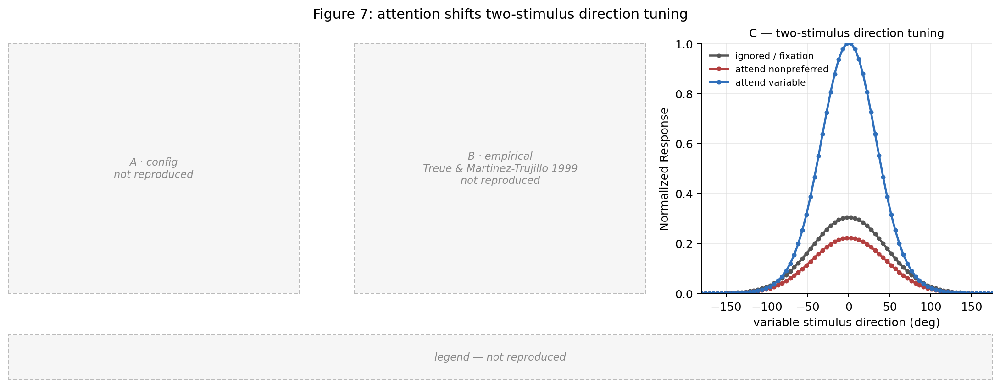</td></tr>
</table>

Ordering is right (attend-variable > fixation > attend-nonpreferred) but the attend-variable/fixation **peak ratio is ~3.3 vs the paper's ~1.4** — the attention gain is more than twice too strong. Hard ratio test gates red.

|  | Digitization self-check (ref vs paper) | Final figure (impl vs paper) |
|---|---|---|
| panel 7C | ✅ faithful | ❌ divergent — fixation & nonpref crushed (ratio ~3.3 vs ~1.4) |
| **figure** | ✅ **faithful** | ❌ **divergent** |

| Tier | Check | Result |
|------|-------|--------|
| qualitative | 7C peak ordering | ✅ pass |
| hard | 7C variable over fixation ratio vs digitized | ❌ **FAIL (gates)** |
| soft | 7C shape vs digitized | ⚠️ soft-fail (reported) — max Δ 0.41 (curves) |
| soft | 7C variable over nonpref ratio vs digitized | ⚠️ soft-fail (reported) |

## How it was verified — and how it slipped through

**The auditors passed this as faithful, and were wrong.** The original tests asserted only
*qualitative shape* claims ("attended above ignored," "same width," "multiplicative scaling")
and an explicit "absolute magnitude is non-binding" convention excused exactly the magnitude
errors above. A normalization model's magnitudes are its result, so that convention was a
leniency hole. What caught the divergences was a **human eye on the side-by-side** plus
**pinning each panel's axes to the paper's** (which turned Fig 4E's hidden 390% overflow into
a failing test).

**The systemic fix — now in place.** Each paper curve is **digitized** (~a dozen points off
the panel image) into `article_aware/figures/figure_<N>/panel_<X>_digitized.json`. A
**Phase-A-owned view** renders that digitized reference *and* the implementation record
through identical pinned axes (so Phase B cannot deviate on style/limits), and the digitized
reference passed a **VLM self-check** against the paper panel. Three test tiers
(`article_aware/extracted_data/test_tier_*.py`) then compare implementation to reference:

- **qualitative** + **hard** *gate* — a fail is a build fail. These catch the four magnitude
  divergences (4E, 5, 6, 7) deterministically.
- **soft** is *measured and reported, never blocks* — for claims the digitization isn't
  trusted to the last percent. The mechanical **dozen-point shape check**
  (`test_tier_shape.py`) lives here: it requires the model curve to pass within tolerance of
  every digitized point across the range, which is what surfaces Figs 2/3's curve-shape
  divergence (2A max Δ 0.22, 3C max Δ 0.28) that the endpoint-only hard tests missed. A
  human promotes any soft check to a hard gate with a one-line `tier` flip.

This is the lesson the worked example bought: left to its own judgment the extraction agent
authored a few *scalar* hard tests the model happened to pass; the divergence was in *shape*.
The mechanical dozen-point shape check, generated from the digitized points rather than chosen
by the agent, is the backbone that makes shape (not just endpoints and ratios) measurable.

**No constructed stub.** Every figure is a live `protocols.run_figure_*` → `measurements` →
`views` computation from the divisive-normalization equations — the divergences are genuine
model behavior, not a hand-built answer. Audit records: `logs/faithfulness_audit/`; open
items: `logs/spec_questions.md`.

## Repository layout

`implementation/src/rh_model/` holds the model (`model.py`), protocols, measurements, and `views.py` (`python -m rh_model.views` writes the reproduced + reference PNGs). `article_aware/spec/` carries the spec, citations, and calibration ledger; `article_aware/figures/` the paper images, per-panel crops/descriptions, and the **digitized references** (`figure_<N>/panel_<X>_digitized.json`); `article_aware/extracted_data/` the **three-tier panel tests** (`test_tier_*.py`, `rh_tier_helpers.py`) and `test_panel_axes.py`; `figures_reproduced/` the committed paper-vs-digitization-vs-implementation PNGs; `logs/` the audit and spec-question records.
