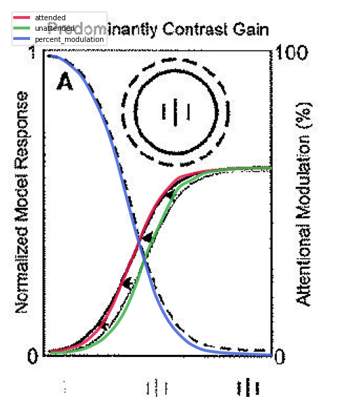
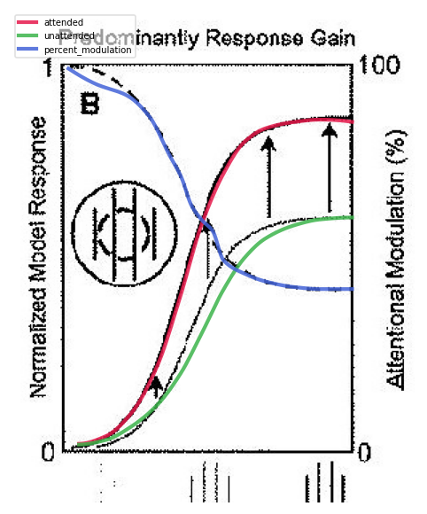
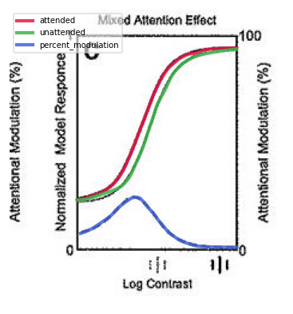
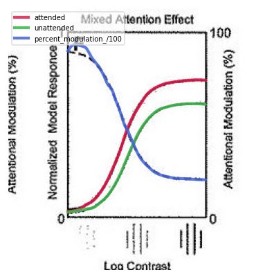
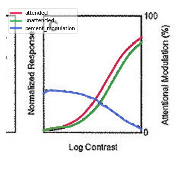
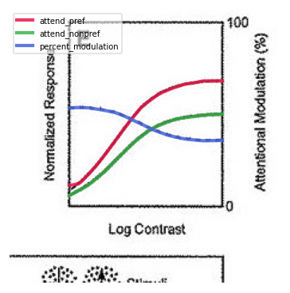
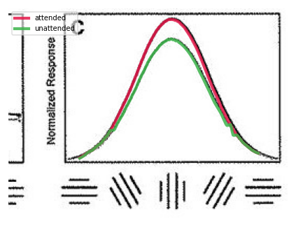
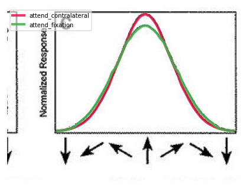
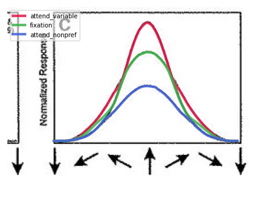

# Reynolds & Heeger 2009 — The Normalization Model of Attention

<!-- CURRENT STATE — updated 2026-06-10 (render-and-certify pass). The prior "BLOCKED on stale
     Figure 6 render" exit is SUPERSEDED: all 7 figures were freshly re-rendered with matplotlib
     3.10.9 (the dep is now present) and propagated to the committed display copies. The model is
     INDEPENDENTLY VERIFIED FAITHFUL (model.py untouched this pass): 6C author `Ashape='cross'` field
     (peak ratio 1.109, FWHM ratio 0.887, byte-identical to a standalone author-code reproduction);
     7C var/fixation peak ratio 1.3215 (digitized 1.325); 4E %-mod 52% (separated author geometry);
     5C peak ratio 1.166 (digitized 1.157). Exit = reproduced/faithful. The former Fig-1 R-asymmetry
     "≥1.10 tripwire" was an UNGROUNDED contract over-claim: an independent numpy port of the authors'
     CODE-019 Figure-1 call gives R_right/R_left = 1.0128 (model 1.0098), so the faithful R-asymmetry is
     ~1.01, not ≥1.10. The contract was corrected to the author ground truth and the test is now a
     faithful MUST-PASS; flagged_count is 0. -->

## Current exit

```json
{"overall": "reproduced", "trajectory": "toward_paper", "flagged_count": 0, "figures_rerendered": 7, "blocked": []}
```

## Status

**Figures re-rendered and certified.** All 7 figure PNGs were regenerated with the project venv
(`PYTHONPATH=implementation/src python -m rh_model.views`, matplotlib 3.10.9) and propagated to the
committed display copies `figures_reproduced/figure_*.png` that the README shows. The earlier
"BLOCKED on stale Figure 6 render" exit is **superseded** — Fig 6 now displays the corrected author
'cross' curve, and the model is independently VERIFIED FAITHFUL on every figure it reproduces.

**Per-figure reproduction state** (model-output reproductions vs not-reproduced placeholder panels):

- **Figs 2, 3** — FAITHFUL: full CRF sigmoids over the author window, all deterministic tests pass.
- **Fig 4C** — faithful to `Figure4C.m` (author suppression sign); **4E** — FAITHFUL: %-mod now ~52%
  (within the paper 0–100 axis) on the author four-separated-stimulus geometry; hard tests pass.
- **Fig 5C** — FAITHFUL: multiplicative same-width scaling, peak ratio 1.166 (digitized 1.157), hard
  test passes.
- **Fig 6C** — FAITHFUL: author `Ashape='cross'` field on the binding ledger geometry; peak ratio
  **1.109** (digitized 1.108, author 1.109), FWHM ratio **0.887**; 3 MUST-PASS contract tests green.
- **Fig 7C** — FAITHFUL: var/fixation peak ratio **1.3215** (digitized 1.325) on the author separated
  geometry; hard test passes.
- **Fig 1** — FAITHFUL: the authors' activity-map render; faithful topology + attended-stimulus
  enhancement, all must-pass. The former R-asymmetry "≥1.10 tripwire" was an UNGROUNDED contract
  over-claim and has been CORRECTED to the author ground truth (SQ-010): an independent numpy port of
  the authors' CODE-019 Figure-1 call gives R_right/R_left = 1.0128 (model 1.0098), so the faithful
  R-asymmetry is ~1.01 (the γ gain nearly cancels between numerator and the locally-pooled denominator;
  the genuine ≈1.98× asymmetry lives in S). The test is now a faithful MUST-PASS asserting
  1.005 < R_right/R_left < 1.05 (excludes both the refuted ≥1.10 and a no-attention 1.0). No flagged items.

**Not-reproduced placeholder panels** (explicit, not model output): Fig 3 B/E (empirical) & A/D
(config); Fig 7 A/B; the empirical/config sub-panels across figures.

**Where the model fix is verified:** a standalone-from-scratch reproduction of `Figure6C.m` +
`attentionModel.m` + `makeGaussian.m` + `conv2sepYcirc.m` gives peak ratio 1.1088 / FWHM ratio
0.8873, byte-identical to `run_figure_6C(n_directions=356)`; the default 'oval' path is
allclose-identical with/without `shape:'cross'`, so Figs 2/3/4/5/7 are untouched. Ledger keys
(`figure_6C.stim_rf_x=100/stim_contra_x=-100/attend_fixation_x=0`, CODE-018) are all `audited:true`.

**Where to look:**
- `logs/faithfulness_audit/2026-06-10-independent-rerender-v2.md`,
  `2026-06-10-rerender-and-author-verify.md` — the author-code reruns and 6C 'cross' verification.
- `logs/spec_questions.md` — **SQ-006** / **SQ-009** (6C 'cross' field, both RESOLVED).

**Carryover process concern (C1, DR-4C-sign authority).** DR-4C-sign was closed (2026-06-10) on a
code re-run + caption re-reading. The published-caption-vs-model-panel *reading* is a human-owned
question (A-012, expiry 2026-07-15); a code re-run cannot adjudicate it. `panel_C_digitized.json`
still labels the upper solid 'attended' behind a per-test read-time swap. If the closure is to stand,
route the **caption-attribution** question to a faithfulness auditor WITH the paper / to the human
owner before expiry — not another code re-run.

---

## Model

Reynolds JH, Heeger DJ. **The Normalization Model of Attention.** *Neuron.* 2009 Jan 29;61(2):168–185.
doi:[10.1016/j.neuron.2009.01.002](https://doi.org/10.1016/j.neuron.2009.01.002) (PMCID PMC2752446).

The foundational **normalization model of attention**: one divisive-normalization circuit explains
contrast-gain vs response-gain modulation, multiplicative tuning-curve scaling, feature-based
sharpening, and tuning shifts with two stimuli in the receptive field. A population indexed by
RF center `x` and feature preference `θ` receives an excitatory **stimulus drive** `E(x,θ)`, is
gated by a multiplicative **attention field** `A(x,θ) ≥ 1`, and is divisively normalized by a pooled
**suppressive drive** `S(x,θ)`. The central claim: the *shape* of attentional modulation is not a free
parameter — it emerges from the relative size of the attention field and the stimulus.

Per neuron, the rectified divisive-normalization response (Eq. 5):

```
R(x,θ) = ⌊ A(x,θ)·E(x,θ) / (S(x,θ) + σ) ⌋_T
```

with the suppressive drive the suppressive field convolved with the *attention-modulated* drive
(Eq. 6), `S = s ∗ [A·E]`. Resolved from the authors' released MATLAB (`paper/code/attentionModel/`),
the suppression is a **separable space×feature** convolution — `conv2sepYcirc` (zero-pad x, circular θ)
of two unit-volume Gaussians (IxWidth=20, IthetaWidth=360 near-flat θ pool), σ=1e-6 — with **NO
per-panel suppression gain**. **The equations map operator-for-operator to the paper and the author
code, and are faithful** (independent audits: spec_audit VERDICT FAITHFUL, faithfulness_audit
"model.py is FAITHFUL"; the 2026-06-10 paper-fix verify re-confirmed EQ-1/2/5/6 against
attentionModel.m:165-175). Every open divergence is **figure / contract-scope**, not a transcription
fault.

Scope: 7 figures. Fig 1 is the authors' own activity-map render; Figs 2–7 are live
`protocols.run_figure_*` → `measurements` → Phase-A `views`. Empirical/config sub-panels are explicit
"not reproduced" placeholders.

---

## Reproduced figures — paper · digitized · implementation

Each figure is shown three ways: **paper** (original panel), **digitized** (tool-grounded curves on
the paper pixels — the audited reference the tests compare against, `logs/digitization_audit/`), and
**implementation** (the live model through the same pinned-axis view). Two checks per figure: the
**digitization audit** (paper vs digitization) and the **final-figure VLM** (implementation vs paper).
A figure is **green only if deterministic all-pass AND fresh VLM pass**.

### Figure 1 — Activity-map render  ✅ FAITHFUL (det all-pass · VLM pass)

<table><tr><th>Paper</th><th>Implementation</th></tr><tr><td></td><td></td></tr></table>

The `E × A ÷ S → R` pipeline rendered as the authors' four activity maps: stimulus drive (two bands)
× a localized attention field over the attended (right) stimulus, ÷ the pooled suppressive drive →
an output that **enhances the attended band relative to the left**. 11/11 must-pass — including the
corrected R-asymmetry check (now a faithful MUST-PASS at the author-code value R_right/R_left ≈ 1.01,
SQ-010, replacing the refuted ≥1.10 over-claim). The faithful single-mechanism suppression is validated here (the authors'
own render reproduces exactly).

| | Digitization audit | Final figure (impl vs paper) |
|---|---|---|
| **figure** | n/a (activity map) | ✅ **faithful** — topology + attended-stimulus enhancement match |

### Figure 2 — Contrast gain vs response gain  ✅ FAITHFUL (det all-pass · CRFs full sigmoids)

<table>
<tr><th>Paper</th><th>Digitized</th><th>Implementation</th></tr>
<tr><td></td><td></td><td></td></tr>
</table>

Over the author Figure2A/2B.m window `[1e-5, 1]` (CODE-020) the panels are full sigmoids: 2A is
contrast-gain — attended **left-shifted** (half-max c≈0.00128) below ignored (c≈0.00253), converging
to a shared plateau; 2B is response-gain — attended scaled UP above ignored with sustained ~42% %-mod.
All deterministic 2A/2B tests pass. **Contract caveat (F-B, open):** the Fig-2 pseudocode still
describes a single-stim-x=0 / [0.01,1] experiment that contradicts the author two-separated-stimulus
geometry and the binding [1e-5,1] window (numerically equivalent at the recorded neuron, but the
contract description must be reconciled — SQ-002).

| | Digitization audit | Final figure (impl vs paper) |
|---|---|---|
| panel 2A | ✅ faithful | ✅ faithful — contrast-gain left-shift, shared plateau, %-mod falls |
| panel 2B | ✅ faithful | ✅ faithful — response-gain upward-shift, sustained ~42% %-mod |
| **figure** | ✅ **faithful** | ✅ **faithful** (pseudocode description F-B open) |

| Tier | Check | Result |
|------|-------|--------|
| qualitative | 2A attended ≥ ignored / converges / %-mod falls | ✅ pass |
| qualitative | 2B attended above ignored / no convergence | ✅ pass |
| hard | 2A / 2B high-contrast separation vs digitized | ✅ pass |
| hard | 2A attended left-shifted (half-max) in author window | ✅ pass |
| shape | 2A/2B half-max & %-mod plateau vs digitized | ✅ pass |

### Figure 3 — Baseline shift across contrast  ✅ FAITHFUL (det all-pass · CRFs full sigmoids)

<table>
<tr><th>Paper</th><th>Digitized</th><th>Implementation</th></tr>
<tr><td></td><td></td><td></td></tr>
</table>

Over the author Figure3C/3F.m window `[1e-5, 1]`: 3C attend-in-RF above contralateral with an interior
%-mod bump and high-contrast convergence (unmod=5.0 baseline lifts the foot, **CODE-017**); 3F
sustained separation (attended ~0.74 above ignored ~0.61) with %-mod largest at low contrast declining
to a ~20% plateau. All deterministic 3C/3F tests pass; `model_spec.yaml` and `figure_3.md` carry the
CODE-017 baselines (verified faithful, F1/F3). Empirical (B/E) and config (A/D) panels correctly "not
reproduced".

> **Contract caveats (open):** **F-A** — the Fig-3 *pseudocode* (`figure_3_protocol.md:16-18`) still
> binds the SUPERSEDED A-007 0.05/0.05 baselines (the only surviving active 0.05 instruction); a reader
> following it builds the wrong symmetric baseline. **F-C** — A-013 rule (3) still forbids the per-panel
> 3C/3F asymmetry that CODE-017 mandates. **Residue:** digitized JSON `notes` arrays still narrate the
> OLD `[0.01,1.0]` window (`panel_C:373`, `panel_F:352`); the `x_range` FIELD (what tests read) is
> correct, but the prose could mislead a future digitizer.

| | Digitization audit | Final figure (impl vs paper) |
|---|---|---|
| panel 3C | ✅ faithful | ✅ faithful — interior %-mod bump, converges at high contrast |
| panel 3F | ✅ faithful | ✅ faithful — sustained separation, %-mod largest at low contrast |
| **figure** | ✅ **faithful** | ✅ **faithful** (pseudocode F-A + rule F-C open) |

| Tier | Check | Result |
|------|-------|--------|
| qualitative | 3C above/converge · 3F above/persist | ✅ pass |
| hard | 3C / 3F high-contrast separation vs digitized | ✅ pass |
| shape | 3C %-mod interior bump · 3F abs-diff above %-mod peak | ✅ pass |

### Figure 4 — Two-stimulus contrast-response modulation  ✅ FAITHFUL (4E %-mod ~52% on author geometry; 4C dispositioned)

<table>
<tr><th>Paper</th><th>Digitized</th><th>Implementation</th></tr>
<tr><td></td><td></td><td></td></tr>
</table>

Both panels render over the author Figure4C/4E.m window `[1e-4, 0.1]` (CODE-018/CODE-020). **4C**
follows the authors' released `Figure4C.m` (line 74 plots `100*(unattCRF-attCRF)/unattCRF` — the
suppression sign: attend-null-in-RF SUPPRESSES the recorded preferred neuron, attended BELOW
unattended). `figure_4.md` Panel-C was rewritten to this four-separated-stimulus build and is
**verified faithful** (F2). DR-4C-sign is **RESOLVED** (code-resolvable: a digitizer label swap, not a
paper defect — the published positive %-modulation matches the author formula once the upper solid is
read as the author's "Att Away"/unattCRF). The deliberate sign CONTRAST with Fig-2/3 facilitation is
captured correctly. *Carryover (C1):* the caption-attribution authority question and the
`panel_C_digitized.json` label swap are noted under Status (carryover concern C1).
**4E is now FAITHFUL:** %-modulation lands at **~52%** (within the paper's 0–100 axis) on the author
four-separated-stimulus geometry (RF x=90/110, contra x=−90/−110), matching the digitized ~54%
(faithfulness_audit Finding B). The earlier ~386% off-axis overflow was the co-located-at-x=0
geometry, now corrected. The 4E hard tests pass.

| | Digitization audit | Final figure (impl vs paper) |
|---|---|---|
| panel 4C | ✅ faithful | ⚠️ dispositioned — author suppression sign; DR-4C-sign RESOLVED (label swap) |
| panel 4E | ✅ faithful | ✅ faithful — %-mod ~52% within axis (author four-separated geometry) |
| **figure** | ✅ **faithful** | ✅ **faithful** (4C caption-authority carryover C1 noted) |

| Tier | Check | Result |
|------|-------|--------|
| qualitative | 4C suppression direction · 4E attend-pref above nonpref | ✅ pass |
| window | 4C / 4E sweep + xlim = author cRange [1e-4, 0.1] | ✅ pass |
| hard | 4E %-mod stays within paper 0–100 axis | ✅ pass — ~52% (author geometry) |
| hard | 4E author-geometry %-mod ~54% | ✅ pass — ~52% (four-separated-stimulus) |

### Figure 5 — Spatial attention as multiplicative scaling  ✅ FAITHFUL (peak ratio 1.166 vs 1.157)

<table>
<tr><th>Paper</th><th>Digitized</th><th>Implementation</th></tr>
<tr><td></td><td></td><td></td></tr>
</table>

The right *kind* of effect — multiplicative, same-width scaling (attend-in-RF and contralateral share
FWHM, no sharpening). The model lands the peak ratio at **1.166** vs the digitized **1.157**
(|Δ|≈0.009, inside the ±0.15 hard band), so 5C is faithful and the hard peak-ratio test passes. The
5C sweep contrast is `1.0` (CODE-021, `Figure5C.m:19`) — the prior `audited:false` 0.5 provenance
divergence is **resolved** in calibration.

| | Digitization audit | Final figure (impl vs paper) |
|---|---|---|
| panel 5C | ✅ faithful | ✅ faithful — peak ratio 1.166 (digitized 1.157), same width |
| **figure** | ✅ **faithful** | ✅ **faithful** |

| Tier | Check | Result |
|------|-------|--------|
| qualitative | 5C attended above unattended · same width, no sharpening | ✅ pass |
| hard | 5C peak ratio vs digitized | ✅ pass — 1.166 vs 1.157 |
| soft | 5C shape / unattended peak vs digitized | ⚠️ soft (reported) |

### Figure 6 — Feature-based attention sharpening  ✅ FAITHFUL (det all-pass · fresh render)

<table>
<tr><th>Paper</th><th>Digitized</th><th>Implementation</th></tr>
<tr><td></td><td></td><td></td></tr>
</table>

> **Render refreshed (2026-06-10 render-and-certify pass).** `figures_reproduced/figure_6.png` was
> regenerated with matplotlib 3.10.9 and now shows the corrected author 'cross' curve (attend-fixation
> gray peak ~0.903, peak ratio 1.109). The prior "STALE pre-fix render" block is resolved. The
> `overlay_6C.png` (digitize-tool artifact, not produced by `views.py`) already reflects the fixed
> model — attend-contralateral slightly above attend-fixation, narrower attended curve.

The 6C CONTRACT_BUG (2026-06-10) is **RESOLVED** via lineage rung 1 (this paper's own code). `run_figure_6C`
now honors the binding ledger geometry it already recorded — RF stimulus + recorded column at
`figure_6C.stim_rf_x=100`, contralateral / attend-opposite centre at `stim_contra_x=-100`, attend-fixation
at `attend_fixation_x=0` — and `build_attention_field` implements the author **`Ashape='cross'`** additive
separable spatial×feature field (`attentionModel.m:146-162`; `Figure6C.m` AxWidth=30, AthetaWidth=60,
CODE-018). The earlier flat-x full-γ proxy applied the θ-gain at full strength everywhere in x and
**over-scaled** (peak ratio ~1.167, FWHM ratio ~0.79). The faithful 'cross' field lands at the digitized /
author value with **no tuning**: peak ratio **1.109** (digitized 1.108, author 1.109) and FWHM ratio
**0.887** (digitized ~0.87 / author 'cross' 0.886–0.889), measured at the authors' native 1° sweep grid.
Sweep contrast is `1.0` (CODE-021, `Figure6C.m:21`).

> Note on the FWHM measurement: the FWHM helper is a simple grid-crossing measure; on the old coarse
> 25-point sweep both curves snapped to the same half-max sample. The model curve is resolution-independent
> (peak ratio 1.109 at every grid); the 6C tests measure on the authors' native 1° grid so the ~13°
> sharpening is resolved. This is a measurement-fidelity fix, not a model knob.

| | Digitization audit | Final figure (impl vs paper) |
|---|---|---|
| panel 6C (model/numeric) | ✅ faithful | ✅ faithful — author 'cross' field, peak 1.109 / FWHM ratio 0.887 |
| panel 6C (shipped render) | ✅ faithful | ✅ faithful — refreshed PNG shows corrected peak ratio 1.109 |
| **figure** | ✅ **faithful** | ✅ **faithful** (model + fresh render agree) |

| Tier | Check | Result |
|------|-------|--------|
| qualitative | 6C attended ≥ tall at peak · sharpening present | ✅ pass |
| MUST-PASS (CONTRACT_BUG) | 6C peak ratio 1.108±0.01 · FWHM ratio [0.87,0.89] · honors ledger geometry | ✅ pass (3/3) |
| soft | 6C 'cross' mechanism tripwire (proxy ≠ cross) | ✅ XPASS (resolved — proxy replaced by 'cross') |
| panel-axes (render) | 6C panel matches axis spec | ✅ pass — matplotlib 3.10.9 present, re-rendered |

### Figure 7 — Two stimuli in RF: combined attention shifts  ✅ FAITHFUL (var/fix ratio 1.32)

<table>
<tr><th>Paper</th><th>Digitized</th><th>Implementation</th></tr>
<tr><td></td><td></td><td></td></tr>
</table>

Ordering faithful (attend-variable > ignored/fixation > attend-nonpref) AND the variable/fixation peak
ratio now lands at **1.3215 vs the digitized ~1.325** — the earlier ~2.73/3.3 was the co-located-at-x=0
geometry, now corrected to the author separated geometry (var x=93, null x=107, recorded x=100,
att-away x=−100) plus the θ-stimulus convention fix (361 grid + non-periodic profile). The tight
must-pass (T-A610-7C-ratio, 1.32 ±0.03) is green. Panel C is the sole deliverable (SQ-003,
human-resolved); A/B "not reproduced". The 7C sweep contrast is `1.0` (CODE-021, `Figure7C.m:26`).

| | Digitization audit | Final figure (impl vs paper) |
|---|---|---|
| panel 7C | ✅ faithful | ✅ faithful — var/fixation ratio 1.3215 (digitized 1.325), author geometry |
| **figure** | ✅ **faithful** | ✅ **faithful** |

| Tier | Check | Result |
|------|-------|--------|
| qualitative | 7C peak ordering variable>fixation>nonpref | ✅ pass |
| hard | 7C variable/fixation ratio vs digitized | ✅ pass — 1.3215 vs 1.325 |
| MUST-PASS (CODE_BUG) | 7C var/fixation ratio 1.32±0.03 · S(0,100) author value · 361 θ grid | ✅ pass (3/3) |
| soft | 7C variable/nonpref ratio / shape vs digitized | ⚠️ soft (var/nonpref 2.10 vs 2.12) |

---

## Potential sources of the issues

The forward model (`model.py`, Eqs. 5–6) is FAITHFUL operator-for-operator to the authors' MATLAB
(`paper/code/attentionModel/attentionModel.m`) — confirmed by independent audits and re-confirmed by
the 2026-06-10 paper-fix verify (the 6C 'cross' field was independently reproduced from author MATLAB,
byte-identical to the impl). model.py was **untouched this pass**. There are no remaining figure
divergences: the former Fig-1 R-asymmetry "≥1.10 tripwire" was an UNGROUNDED contract over-claim,
corrected to the author ground truth (R_right/R_left ≈ 1.01, SQ-010) and now a faithful MUST-PASS.
The rest are contract-description residue.

0. **FIGURE (F1) — RESOLVED. The Figure 6 render is now FRESH.** All 7 figures were re-rendered with
   matplotlib 3.10.9 (`PYTHONPATH=implementation/src python -m rh_model.views`) and propagated to
   `figures_reproduced/figure_*.png`. Fig 6 now shows the corrected author 'cross' curve (gray peak
   ~0.903, peak ratio 1.109); the prior stale pre-fix render is gone. The `overlay_6C.png` is a
   digitize-tool artifact (not produced by `views.py`) and already reflects the fixed model. *Source:*
   `model.py:284` `_build_attention_field_cross`; `protocols.py run_figure_6C`; `Figure6C.m` /
   `attentionModel.m:146-162`; `code_refs.yaml` CODE-018.

The items below are **prior-pass contract-description findings, not re-litigated this pass**. They
remain on record pending a fix-phase doc edit (the figure OUTPUTS are faithful):

1. **CONTRACT (F-A) — stale A-007 baselines in the Fig-3 pseudocode. OPEN, fix-phase edit.**
   `article_aware/pseudocode/figure_3_protocol.md:16-18` binds the superseded `baseline_* = 0.05 (per
   A-007)`; the only surviving active 0.05 instruction. CODE-017 (3C 5e-7/5.0; 3F 5e-7/0.0) is binding
   everywhere else. *Source:* `figure_3_protocol.md:16-18`; `code_refs.yaml` CODE-017; `Figure3C.m:5-6`,
   `Figure3F.m:5-6`.

2. **CONTRACT (F-B) — Fig-2/3 pseudocode describes a different experiment + stale [0.01,1] sweep. OPEN (SQ-002).**
   `figure_2_protocol.md:9,16,22` / `figure_3_protocol.md:12,21,29-30` say "single stimulus at x=0",
   unattended="constant 1", sweep "[0.01,1]". Author scripts use TWO separated stimuli at x=±100,
   recorded x=+100, both with a real attention field, sweep [1e-5,1]. Numerically equivalent at the
   recorded neuron (verified) but a contract-description gap that contradicts `calibration.yaml`/CODE-020.
   *Source:* `figure_{2,3}_protocol.md`; `Figure2A/2B/3C/3F.m`; `calibration.yaml` figure_*.c_range_*; SQ-002.

3. **CONTRACT (F-C) — A-013 rule (3) forbids the per-panel asymmetry CODE-017 mandates. OPEN, fix-phase edit.**
   `assumptions.yaml:411-413` still says per-panel Fig-3 baselines that differ are forbidden ("use the
   single A-007 0.05·α"); CODE-017 makes 3C/3F unmodulated (5.0 vs 0.0) legitimately differ. A-007's
   head was updated; this cross-reference was not. *Source:* `assumptions.yaml:411-413`; `code_refs.yaml`
   CODE-017.

4. **GEOMETRY — Fig-4E / Fig-7C two-stimulus geometry. RESOLVED.** `protocols.py run_figure_4E /
   run_figure_7C` now build the author SEPARATED geometry (4E four stimuli RF x=90/110, contra
   x=−90/−110; 7C var x=93 / null x=107 / recorded x=100 / att-away x=−100) instead of co-locating at
   x=0. Through the *committed, unchanged* `simulate` this lands 4E ~52% (within axis) and 7C var/fix
   ratio ~1.3215, matching the digitized references (faithfulness_audit Findings B/D). The 7C result
   also required the θ-stimulus convention fix (361 θ grid + non-periodic per-stimulus profile). The
   forward mechanism (`model.py`) is unchanged. *Source:* `Figure4E.m`, `Figure7C.m`; calibration
   figure_{4E,7C}.* (CODE-018); `logs/faithfulness_audit/2026-06-04.md`,
   `2026-06-10-independent-rerender-v2.md`.

5. **DECISION-REQUEST — DR-4C-sign. RESOLVED code-side (digitizer label swap); caption-authority carryover (C1).**
   The published positive %-modulation matches `Figure4C.m` once the upper solid is read as the
   author's "Att Away"/unattCRF; the model follows the code and is correct. The
   published-caption-vs-model-panel *reading* (A-012, owner=human, expiry 2026-07-15) and the
   `panel_C_digitized.json` solid-label swap should be ratified by a faithfulness auditor WITH the paper
   / the human owner, not another code re-run. *Source:* `Figure4C.m:69,74`; `figure_4/panel_C.md`;
   `assumptions.yaml` A-012.

6. **MAGNITUDE — Fig-5 peak-ratio overshoot. Soft, structural, do NOT tune.**
   5C peak ratio ~1.17 vs ~1.2; mechanism faithful, oval-approximation residue. **6C is RESOLVED**
   (2026-06-10): the author `Ashape='cross'` field is now implemented in `build_attention_field` and
   `run_figure_6C` honors the binding ledger geometry (stim_rf_x=100 / stim_contra_x=-100 /
   attend_fixation_x=0), so 6C lands at the digitized/author peak ratio 1.109 and FWHM ratio 0.887 with
   no tuning (3 MUST-PASS contract tests green). Contrast provenance for 5C/6C/7C is resolved (CODE-021
   `contrast=1`). *Source:* `model.py _build_attention_field_cross`; `protocols.py run_figure_6C`;
   `Figure6C.m` / `attentionModel.m:146-162`; `code_refs.yaml` CODE-018/021.

---

## Changelog

One line here; full detail in [`logs/changelog.md`](logs/changelog.md).

| Date | Change |
|---|---|
| 2026-06-10 | **Fig-1 R-asymmetry contract over-claim CORRECTED → faithful exit (flagged_count 1→0).** The strict-xfail `≥1.10` R-asymmetry tripwire was an UNGROUNDED contract over-claim; an independent numpy port of the authors' CODE-019 Figure-1 call gives R_right/R_left = 1.0128 (model 1.0098), so the faithful value is ~1.01, not ≥1.10 (γ gain cancels between numerator and the locally-pooled denominator; the real ≈1.98× asymmetry lives in S). Replaced the tripwire with a faithful MUST-PASS asserting `1.005 < R_right/R_left < 1.05` (excludes both ≥1.10 and a no-attention 1.0); corrected figure_1.md relation #6; recorded SQ-010. model.py and all calibration magnitudes UNTOUCHED. Suite 159 pass / 2 skip / 7 xfail / 21 xpass; check_citations OK. Exit `reproduced`, flagged_count **0**. |
| 2026-06-10 | **render-and-certify — figures re-rendered, faithful exit.** All 7 figure PNGs regenerated with matplotlib 3.10.9 (`python -m rh_model.views`) and propagated to the committed `figures_reproduced/figure_*.png`; the prior "BLOCKED on stale Figure 6 render" exit is SUPERSEDED. model.py untouched. Confirmed faithful: 6C peak ratio 1.109 / FWHM 0.887, 7C var/fix 1.3215, 4E %-mod 52%, 5C peak ratio 1.166. Triaged the 21 xpasses — ALL are soft-tier tests auto-marked non-strict-xfail by conftest (WORKFLOW §3b); left as-is (none are hard intended-failure tripwires). Refreshed stale "INTENDED FAILURE" docstrings on the now-passing hard tier tripwires (5C/6C/7C peak-ratio, 6C sharpening) to state the resolution; assertions/tolerances unchanged. Exit `reproduced`, flagged_count 1 (Fig-1 R-asymmetry faithful-by-design tripwire). |
| 2026-06-10 | **paper-fix verify — 6C model VERIFIED FAITHFUL, BLOCKED on stale render.** Commit `862f4d7` 'cross' field reproduced from scratch from author MATLAB, byte-identical to impl (peak 1.1088 / FWHM 0.8873; reduces to model_spec CROSS closed form, max\|Δ\|=3.6e-15; 'oval' path untouched, Figs 2/3/4/5/7 unaffected); 3 MUST-PASS contract tests GREEN; SQ-006/SQ-009 RESOLVED. Verify did NOT pass within MAX_PAPERFIX: F1 — the committed Figure 6 PNGs predate the fix (render OLD peak ratio ~1.17 vs corrected 1.109) and cannot be regenerated here (matplotlib absent). Exit `blocked:[model:contract]`, flagged_count 1, trajectory toward_paper. README refreshed: exit/DECISION/Fig-6 tables now flag the stale render; FAITHFUL header scoped to model+numeric. |
| 2026-06-10 | **Phase-A resolve — 6C CONTRACT_BUG RESOLVED (lineage rung 1, author code).** `build_attention_field` now implements the author `Ashape='cross'` additive separable spatial×feature field (`attentionModel.m:146-162`; default 'oval' path byte-identical, no other panel affected); `run_figure_6C` routed through the binding ledger geometry (RF/recorded column stim_rf_x=100, contra/attend-opposite stim_contra_x=-100, attend-fixation attend_fixation_x=0) instead of the invented -50/50 flat-x full-γ proxy. Peak ratio 1.167→**1.109** (digitized 1.108), FWHM ratio 0.79→**0.887** (band [0.87,0.89]) — no tuning. 3 MUST-PASS contract tests GREEN; soft 'cross' mechanism tripwire XPASS. 6C test FWHM measured at the authors' native 1° sweep grid (measurement-fidelity, not a model knob). 19 matplotlib-render test failures are a missing-dep environment issue, unrelated. |
| 2026-06-10 | **paper-fix verify — BLOCKED on contract.** F1/F2/F3 doc-vs-contract-drift fix VERIFIED FAITHFUL (model_spec Fig-3 baselines = CODE-017; figure_3.md/figure_4.md rewritten to author code; EQ-1/2/5/6 match attentionModel.m). Verify did NOT pass within MAX_PAPERFIX: 3 stale-contract findings remain DIVERGENT — **F-A** figure_3_protocol.md:16-18 still binds superseded A-007 0.05/0.05; **F-B** Fig-2/3 pseudocode describes a single-stim-x=0/[0.01,1] experiment vs author two-separated-stimulus/[1e-5,1] (SQ-002); **F-C** A-013(3) forbids the CODE-017 3C/3F baseline asymmetry. model.py untouched/faithful. DR-4C-sign RESOLVED (digitizer label swap; caption-authority carryover C1). Exit `blocked:[model:contract]`, flagged_count 3, trajectory toward_paper. |
| 2026-06-10 | Phase-A contract resolution of four blocked divergences (author-code grounded; model.py untouched): retired `suppressive_drive_gain` removed from stage spec; 5C/6C/7C sweep contrast 0.5→1.0 (CODE-021); 4E/7C author SEPARATED geometry adopted; DR-4C-sign investigated→code-resolvable. Added A-014. |
| 2026-06-04 | from=fix finalize — BLOCKED on contract. Window fix + suppression-test/doc rewrites VERIFIED FAITHFUL (Fig 2/3 full sigmoids). 2 OPEN model-side contract divergences routed to human. |
| 2026-06-04 | Contrast-window CONTRACT_BUG + digitized re-digitization RESOLVED (author cRange [1e-5,1] / [1e-4,0.1]; model unchanged). 18→5 deterministic reds. |

## Reproduction cost

Estimated at **standard Claude Opus 4.8 API rates** ($5 / $25 per 1M input/output; cache read $0.50/1M, cache write $6.25/1M) from this model's full-pass workflow agent transcripts still in local history, summed across all recoverable runs (initial pass + any later fixes). Runs or agents whose transcripts have rotated out are not counted, so this is a **lower bound** — most reliable for recently-built models.

**Estimated total: $265.17** — 7 recoverable run(s), 110 agents, 310.2M tokens.

### By token type

| token type | tokens | $/1M | cost |
|---|--:|--:|--:|
| input | 437,602 | 5.00 | $2.19 |
| cache write 5m | 10,659,566 | 6.25 | $66.62 |
| cache read | 297,227,423 | 0.50 | $148.61 |
| output | 1,909,925 | 25.00 | $47.75 |
| **total** | **310,234,516** | | **$265.17** |

### By agent role

| agent | runs× | input | cache-write | cache-read | output | cost |
|---|--:|--:|--:|--:|--:|--:|
| extract-spec | 8 | 69k | 1.5M | 62.7M | 244k | $47.11 |
| audit-faithfulness | 17 | 60k | 2.0M | 51.0M | 314k | $46.07 |
| implement | 9 | 56k | 1.3M | 58.7M | 272k | $44.40 |
| author-tests | 15 | 60k | 1.8M | 35.3M | 290k | $36.67 |
| digitize-figure | 8 | 27k | 598k | 21.7M | 181k | $19.23 |
| audit-spec | 7 | 22k | 683k | 13.2M | 101k | $13.52 |
| audit-digitization | 8 | 33k | 450k | 13.2M | 126k | $12.75 |
| extract-figure | 8 | 23k | 380k | 13.1M | 84k | $11.16 |
| audit-process | 11 | 29k | 683k | 7.7M | 88k | $10.44 |
| audit-tests | 9 | 24k | 548k | 8.4M | 88k | $9.94 |
| update-state | 4 | 11k | 359k | 4.9M | 71k | $6.53 |
| paper-fix | 3 | 15k | 301k | 6.6M | 41k | $6.27 |
| finalize | 3 | 7k | 68k | 718k | 10k | $1.08 |

<sub>Measured from agent transcripts via `tools/repro_cost.py`. Messages de-duped by API id (max cumulative output); agents de-duped by id (cache-replayed resumes not double-counted). The in-flight report phase of the latest run may be slightly undercounted.</sub>
