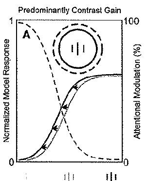
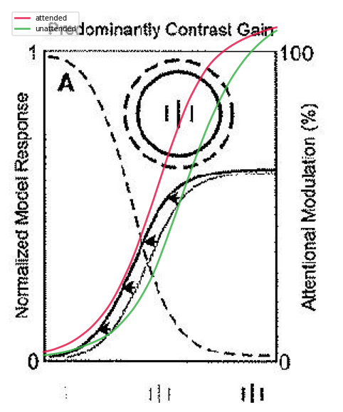
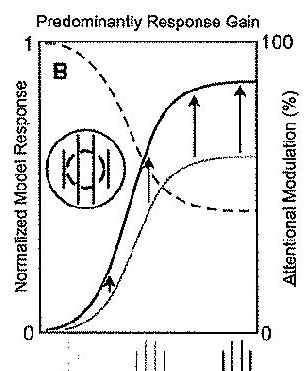
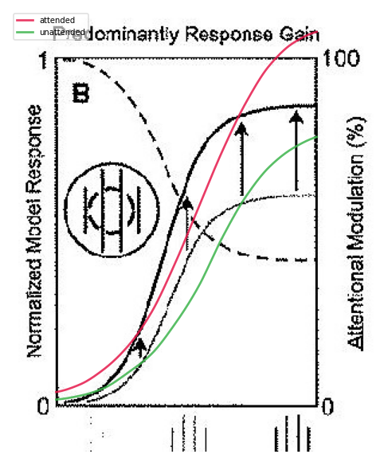
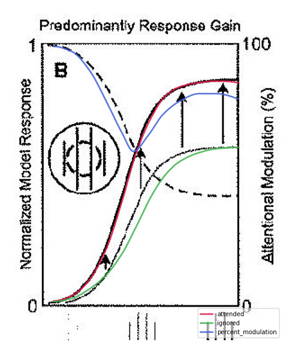

# Figure 2 re-digitization trial — tools + separate critic (2026-06-03)

A trial of the figure-digitization process on R&H Figure 2: a **fresh digitizer agent**
re-did the digitization using the Mode-1 tools (axis calibration, guided curve tracer,
overlay, PCHIP — `neuromodels/framework/figures/digitize.py` in the parent repo), then a
**separate critic agent** (the `audit-digitization` skill, parent repo
`skills/audit-digitization/SKILL.md`) audited it. Neither was the organizer. This page is
the artifact to review.

The overlays below draw the **digitized curves on the actual paper pixels** — the
critic's key view, far more sensitive than two separately-rendered plots.

## The fix: normalization (1.0-pinning → the paper's shared scale)

The old (eyeballed, self-graded) digitization pinned every curve's peak to **1.0**. The
paper actually uses a **shared sub-1.0 scale** across both panels — 2A plateaus lower than
2B, and *that height difference is the figure's contrast-gain-vs-response-gain claim*.

### Panel 2A — Predominantly Contrast Gain
<table>
<tr><th>Paper</th><th>BEFORE — eyeballed (pinned to 1.0)</th><th>AFTER — tool-traced (plateau ~0.61)</th></tr>
<tr>
<td></td>
<td></td>
<td></td>
</tr>
</table>

Before: red/green climb to ~1.0, far above the paper's solid CRFs. After: they plateau at
**~0.61**, tracking the paper; the dashed %-modulation (blue) descends to ~0 correctly.

### Panel 2B — Predominantly Response Gain
<table>
<tr><th>Paper</th><th>BEFORE — eyeballed (pinned to 1.0)</th><th>AFTER — tool-traced</th></tr>
<tr>
<td></td>
<td></td>
<td></td>
</tr>
</table>

After: attended **~0.86**, ignored **~0.60** on the *same axis* as 2A — so 2B's attended
sits visibly higher than 2A's (0.86 vs 0.61). The shared-scale comparison the figure exists
to make is now preserved. **But note the blue %-modulation curve floats above the paper's
dashed line** — that is the open defect the critic caught (below).

## The critic's verdict (independent — it re-traced, did not trust the digitizer)

Full report: [`logs/digitization_audit/figure_2_2026-06-03.md`](../../../../logs/digitization_audit/figure_2_2026-06-03.md).

| Level | Status | Evidence |
|---|---|---|
| **Normalization** | ✅ fixed | Critic re-measured plateaus: 2A 0.615, 2B attended 0.859 / ignored 0.601. Shared sub-1.0 scale; nothing pinned to 1.0; 2B attended > 2A attended on one axis. |
| **Panel 2A** | ✅ `FAITHFUL-DIGITIZATION` | Solids + dashed track the paper. Minor: the attended/ignored split is honestly caveated (the two same-colour curves overlap — tracer limitation), magnitude slightly overstated. No tool-misuse. |
| **Panel 2B** | ❌ `DIGITIZATION-DIVERGENT` | The dashed %-modulation reads **~42–45%** at high contrast (descends monotonically), not the candidate's **~80%** — ~35–40 points off. (Organizer independently confirmed: traced 42.6%, and the solid-curve-implied value is 42.9%.) |
| **Figure 2** | ❌ held (by 2B) | Normalization faithful; 2B %-modulation must be re-digitized to descend to ~43% before the reference is binding. |

## What the trial demonstrates

- The **tools** let a fresh agent *fix* the 40%-of-axis normalization error the old eyeball+self-check loop could not even see.
- The digitizer then made a **fresh** error (2B %-modulation) and **understated it** in its own caveats — the creator's-eye blind spot.
- The **separate critic caught it**, grounded in re-traced pixels, and refused to green the figure — exactly its job.
- The one place the digitizer respected its limits honestly (the 2A monochrome overlap) is where the tracer docstring now warns it to.

**Open defect to close:** re-digitize 2B's %-modulation (trace the lowest dashed line, descending to ~43%), re-audit; then fix the view's `norm_pair` so the rendered reference carries the paper's shared scale.
